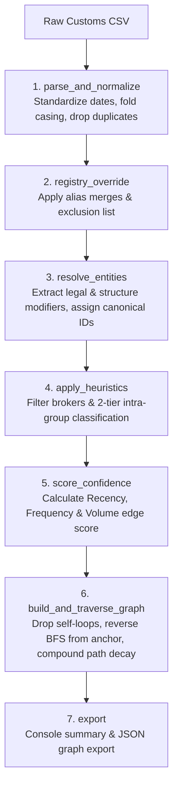

# EcoVadis Tier-N Supplier Discovery Pipeline

A modular Python solution for discovering deep-tier ($T_1, T_2, T_3, \dots, T_N$) supply chain relationships from messy ocean shipment customs data (`customs_extract.csv`), anchored at EcoVadis confirmed Tier-1 supplier **Solstice Materials Co**.

---

## Deliverables & Documentation

- **[Trade-Off Memo (Part 1)](file:///Users/ahmed.koubaa/Desktop/playground/supply-graph-resolver/trade-off-memo.md):** Plain-language evaluation of customs trade data as a Tier-N signal (Coverage, Noise, Confidence, and Build vs. Buy).
- **[Architecture & Heuristics Sketch (Part 2)](file:///Users/ahmed.koubaa/Desktop/playground/supply-graph-resolver/architecture_heuristics_sketch.md):** Pipeline mapping table, edge confidence formula, and system diagrams.
- **[Working Prototype (Part 3)](file:///Users/ahmed.koubaa/Desktop/playground/supply-graph-resolver/tier_n_pipeline.py):** Modular Python script implementing the 7-layer discovery pipeline.
- **[JSON Output Artifact](file:///Users/ahmed.koubaa/Desktop/playground/supply-graph-resolver/resolved_graph_output.json):** Graph-ready JSON export containing nodes, edges, tiers, and audit tags.

---

## Executive Summary

EcoVadis tracks confirmed Tier-1 buyer-supplier relationships. However, deeper supply chain tiers ($T_2, T_3, \dots$) are rarely self-reported. This pipeline ingests public ocean shipment bills of lading (shippers and consignees) to infer multi-tier supplier relationships backwards up the supply chain while handling messy real-world data artifacts: misspelled corporate names, pass-through brokers, structural regional affiliates, missing attributes, and potential graph cycles.

---

## Summary of Trade-Off Memo (Part 1)

For full details, see [`trade-off-memo.md`](file:///Users/ahmed.koubaa/Desktop/playground/supply-graph-resolver/trade-off-memo.md).

- **Why Customs Data?** Tier-1 data stops at the first hop. Customs bill-of-lading data is the only un-self-reported public signal reaching past Tier 1.
- **The Three Costs:**
  1. *Coverage:* Ocean freight landing in the US only (structural blind spot for domestic/truck/air freight).
  2. *Noise:* Renames, corporate group transfers, coincidental collisions, freight forwarders.
  3. *Confidence:* Unconfirmed data; uncertainty compounds per hop.
- **Build vs. Buy Strategy:** Use the free raw customs feed initially to prove customer demand for Tier-N features, then evaluate paid APIs (Panjiva/ImportGenius) specifically to close the modal coverage gap (air/land freight).

---

## Key Pipeline Layers & Architecture

The pipeline follows a single-responsibility, layered architecture implemented in [`tier_n_pipeline.py`](file:///Users/ahmed.koubaa/Desktop/playground/supply-graph-resolver/tier_n_pipeline.py):



---

## Detailed Pipeline Functions

1. **`parse_and_normalize(csv_path)`**
   - Standardizes ambiguous date formats (`13/06/2026` vs `2026-02-05`) using day-first parsing.
   - Cleans whitespace and case-folds company names and product descriptions to lowercase.
   - Identifies and drops exact duplicate rows post-normalization (logged: 2 duplicate rows dropped).

2. **`registry_override(df)`**
   - **Alias Override (`known_affiliate`):** Merges `Bergwerk Mining Alias GmbH` $\rightarrow$ `Solstice Materials Europe GmbH` (confidence 1.0) following internal corporate restructuring.
   - **Exclusion List:** Prevents coincidental name collision `Solstice Analytics Inc` from merging into anchor `Solstice Materials Co`.

3. **`resolve_entities(df)`**
   - Strips legal suffixes (`LLC`, `Inc`, `Pty`, `GmbH`, `Ltd`, `NV`, `SA`, `SL`, `Corp`, `AB`) and corporate structure/region modifiers (`Iberia`, `Europe`, `Holdings`, `Group`, `Distribution`, `Hub`, `Refining`).
   - Assigns anchor ID `ECO-T1-001` to `Solstice Materials Co` and `customs_inf_xxx` to inferred entities.
   - Retains structural variants as distinct nodes to allow two-tier intra-group heuristic parsing.

4. **`apply_heuristics(df, entity_catalog)`**
   - **Pass-through Broker Filter:** Identifies forwarders shipping generic non-material goods (`packaging materials`, `freight`, `logistics`) and parks them (`Global Cargo Solutions LLC`, `Solstice Logistics Hub LLC`).
   - **Two-Tiered Intra-Group Classification:**
     - *Confirmed Affiliates (`known_affiliate`):* Registry alias matches, confidence 1.0, parked.
     - *Candidate Affiliates (`candidate_affiliate_unconfirmed`):* Entities sharing root corporate names via structure/region modifiers (e.g., `Boreal Resins Iberia SL` $\rightarrow$ `Boreal Resins Inc`), tagged with confidence 0.5 and parked separately.

5. **`score_confidence(df_clean)`**
   - Multi-factor Edge Confidence formula:
     $$\text{Edge Confidence} = (0.3 \times \text{Recency}) + (0.4 \times \text{Frequency}) + (0.3 \times \text{Volume})$$
   - Imputes a neutral volume fallback ($0.5$) for missing shipment weights (e.g. `Nordkant Borates AB`).
   - *Docstring Note:* Weights represent an illustrative V1 hypothesis for calibration.

6. **`build_and_traverse_graph(df_clean, entity_catalog)`**
   - Checks and drops `shipper_id == consignee_id` self-loops prior to graph construction.
   - Constructs a `networkx.DiGraph` representing `Shipper` $\rightarrow$ `Consignee`.
   - Performs reverse BFS starting from anchor `ECO-T1-001` (Consignee $\leftarrow$ Shipper) to map Tier 1 through Tier 4 physical suppliers.
   - Computes compounding multiplicative path confidence:
     $$\text{Path Confidence}(T_n) = \prod_{i=1}^n \text{Edge Confidence}_i$$
   - Detects cycles to prevent infinite loops on circular supply routes.

7. **`export(traversal_results, parked_brokers, ...)`**
   - Prints a formatted console summary across 5 distinct sections.
   - Exports graph artifact to [`resolved_graph_output.json`](file:///Users/ahmed.koubaa/Desktop/playground/supply-graph-resolver/resolved_graph_output.json).

---

## Discovered Multi-Tier Supply Chain Results

| Tier | Canonical ID | Supplier Golden Name | Supplied To | Input Product | Edge Conf. | Path Conf. |
| :--- | :--- | :--- | :--- | :--- | :--- | :--- |
| **$T_1$** | `customs_inf_006` | **Boreal Resins Inc** | Solstice Materials Co | Epoxy Resin Compound | 0.89 | **0.892** |
| **$T_1$** | `customs_inf_025` | **Terra Silica Partners** | Solstice Materials Co | Silica Sand | 0.81 | **0.814** |
| **$T_1$** | `customs_inf_003` | **Aurora Pigments Ltd** | Solstice Materials Co | Titanium Dioxide Pigment | 0.78 | **0.779** |
| **$T_1$** | `customs_inf_012` | **Nordkant Borates AB** | Solstice Materials Co | Borate Compound | 0.73 | **0.729** |
| **$T_1$** | `customs_inf_011` | **Meridian Coatings LLC** | Solstice Materials Co | Industrial Coating Additive | 0.63 | **0.631** |
| **$T_1$** | `customs_inf_021` | **Solstice Analytics Inc** | Solstice Materials Co | Laboratory Testing Reagents | 0.61 | **0.609** |
| **$T_2$** | `customs_inf_014` | **Petrochem Feedstock LLC** | Boreal Resins Inc | Bisphenol-A Precursor | 0.76 | **0.676** |
| **$T_2$** | `customs_inf_017` | **Quartz Extraction Co** | Terra Silica Partners | Raw Quartz | 0.66 | **0.537** |
| **$T_2$** | `customs_inf_019` | **Rutile Mineral Exports Pty** | Aurora Pigments Ltd | Titanium Ore Concentrate | 0.63 | **0.488** |
| **$T_3$** | `customs_inf_015` | **Phenol Basestock Corp** | Petrochem Feedstock LLC | Phenol Feedstock | 0.73 | **0.491** |
| **$T_3$** | `customs_inf_009` | **Flocculant Chemicals Pty** | Rutile Mineral Exports Pty | Ore-Processing Flocculant Reagent | 0.73 | **0.356** |
| **$T_4$** | `customs_inf_004` | **Benzene Feedstock Refining Co** | Phenol Basestock Corp | Benzene Feedstock | 0.66 | **0.322** |
| **$T_4$** | `customs_inf_001` | **Acrylamide Monomer Pty** | Flocculant Chemicals Pty | Acrylamide Monomer | 0.66 | **0.234** |

---

## Parked Non-Physical & Intra-Group Entities

### Candidate Affiliates (Unconfirmed - Heuristic Flagged @ 0.5 Confidence)
- `Rutile Mineral Holdings Pty` $\rightarrow$ `Rutile Mineral Exports Pty` (Shared root: `rutile mineral`)
- `Petrochem Feedstock Distribution LLC` $\rightarrow$ `Petrochem Feedstock LLC` (Shared root: `petrochem`)
- `Solstice Materials Iberia SA` $\rightarrow$ `Solstice Materials Co` (Shared root: `solstice materials`)
- `Flocculant Chemicals Group Pty` $\rightarrow$ `Flocculant Chemicals Pty` (Shared root: `flocculant chemicals`)
- `Aurora Pigments Distribution GmbH` $\rightarrow$ `Aurora Pigments Ltd` (Shared root: `aurora pigments`)
- `Boreal Resins Iberia SL` $\rightarrow$ `Boreal Resins Inc` (Shared root: `boreal resins`)
- `Phenol Basestock Holdings Corp` $\rightarrow$ `Phenol Basestock Corp` (Shared root: `phenol basestock`)

### Confirmed Affiliates (Registry Override @ 1.0 Confidence)
- `Bergwerk Mining Alias GmbH` $\rightarrow$ `Solstice Materials Europe GmbH` $\rightarrow$ `Solstice Materials Co`

### Pass-Through Brokers & Forwarders
- `Global Cargo Solutions LLC` $\rightarrow$ `Solstice Materials Co` (Product: `packaging materials`)
- `Solstice Logistics Hub LLC` $\rightarrow$ `Solstice Materials Co` (Product: `packaging materials`)

---

## How to Run

### Requirements
- Python 3.9+
- `pandas`, `rapidfuzz`, `networkx`

### Setup & Execution

```bash
# Create virtual environment
python3 -m venv .venv
source .venv/bin/activate

# Install dependencies
pip install pandas rapidfuzz networkx

# Run the pipeline
python tier_n_pipeline.py
```

---

## File Structure

- [`tier_n_pipeline.py`](file:///Users/ahmed.koubaa/Desktop/playground/supply-graph-resolver/tier_n_pipeline.py): Main runnable Python pipeline script.
- [`customs_extract.csv`](file:///Users/ahmed.koubaa/Desktop/playground/supply-graph-resolver/customs_extract.csv): 12-month extract of ocean shipment customs records.
- [`corporate_registry_notes.txt`](file:///Users/ahmed.koubaa/Desktop/playground/supply-graph-resolver/corporate_registry_notes.txt): Ground-truth companion reference notes.
- [`resolved_graph_output.json`](file:///Users/ahmed.koubaa/Desktop/playground/supply-graph-resolver/resolved_graph_output.json): Graph-ready JSON export artifact containing nodes, edges, tiers, and audit tags.
- [`trade-off-memo.md`](file:///Users/ahmed.koubaa/Desktop/playground/supply-graph-resolver/trade-off-memo.md): Part 1 Trade-off memo on trade data signals (Markdown).
- [`architecture_heuristics_sketch.md`](file:///Users/ahmed.koubaa/Desktop/playground/supply-graph-resolver/architecture_heuristics_sketch.md): Part 2 Architecture sketch, data pipeline mapping, and Mermaid diagrams.
