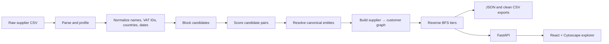

# Supply Graph Resolver

An explainable entity-resolution pipeline and graph explorer for noisy supplier declarations. It turns a mixed-quality CSV into canonical companies, normalized relationships, and an upstream multi-tier supplier graph.

The project deliberately favors **avoiding false merges** over maximizing deduplication. Every transformation is deterministic and can be explained from the source fields.

## Current dataset result

For `ecovadis_practice_supplier_data.csv`:

| Metric | Result |
|---|---:|
| Raw relationship rows | 1,339 |
| Valid company mentions | 2,673 |
| Resolved entities | 407 |
| Aggregated relationships | 414 |
| Review candidate pairs | 3,097 |
| Detected graph cycles | 0 |

NorthGate Textiles resolves to one entity with 49 source mentions. Its upstream graph contains 339 entities across tiers 0–4 and 349 relationships.

## Documentation

- **[Data treatment, architecture, and trade-offs](docs/DATA_PIPELINE.md)** — how every field is cleaned, how matching and resolution work, real inconsistencies found in the CSV, architecture and sequence diagrams, risks, and production recommendations.
- [`ecovadis_practice_notes.txt`](ecovadis_practice_notes.txt) — source-system context and the original data-quality warnings.
- [`output/graph.json`](output/graph.json) — graph-ready output for the current NorthGate run.

## Architecture at a glance



## Repository layout

```text
app.py                 CLI entry point
supply_graph/          Layered data pipeline
backend/               Independent FastAPI adapter and lazy response cache
frontend/              Independent React/Vite application
backend/tests/         API and entity-resolution regression tests
output/                Generated clean tables and graph artifacts
docs/DATA_PIPELINE.md  Detailed engineering and trade-off memo
```

## Setup

Requirements: Python 3.11+ and Node.js 20+.

```bash
python3 -m venv .venv
source .venv/bin/activate
pip install -r requirements.txt

cd frontend
npm install
cd ..
```

## Run the CLI

```bash
source .venv/bin/activate
python app.py \
  --csv ecovadis_practice_supplier_data.csv \
  --company "NorthGate Textiles S.A."
```

Generated files:

- `output/graph.json` — selected entity, upstream nodes and edges, tiers, cycles, and review candidates
- `output/graph.mmd` — Mermaid representation of the selected graph
- `output/relationships_clean.csv` — normalized rows with canonical customer/supplier IDs
- `output/entities_clean.csv` — one golden record per resolved company

The CLI is independent from the web server.

## Run the web application

Start FastAPI from the repository root:

```bash
source .venv/bin/activate
uvicorn backend.main:app --reload --port 8000
```

Start the frontend in a second terminal:

```bash
cd frontend
npm run dev
```

Vite proxies `/api` to FastAPI. For a separately deployed API, set `VITE_API_URL` including the `/api` suffix. Override the default CSV with `SUPPLY_GRAPH_CSV=/path/to/file.csv`.

### API endpoints

| Endpoint | Purpose |
|---|---|
| `GET /api/health` | Liveness check |
| `GET /api/summary` | Source name and lightweight counts |
| `GET /api/rows` | Paginated/searchable raw records |
| `GET /api/entities` | Paginated/searchable golden entities |
| `GET /api/relationships/clean` | Paginated/searchable clean relationships |
| `GET /api/entities/{entity_id}/graph` | Complete upstream tiers for one entity |

Table endpoints accept `offset`, `limit` (maximum 200), and `query`.

The server performs no graph resolution at startup. An uncached request creates the required pandas/NetworkX state, returns JSON, then releases that working state. Only completed responses are cached, keyed by request and source-file modification time.

## Core resolution rules

1. Normalize names, legal suffixes, IDs, countries, dates, and categories.
2. Compare only records in a coarse `country + first two core-name letters` block.
3. Score candidates with `50% name + 30% tax ID + 20% country`.
4. Auto-merge scores ≥85; hold scores from 65 to <85 for review; keep lower scores distinct.
5. Bridge country blocks only when normalized core name and tax ID are exact and populated countries do not conflict.
6. Build edges as `supplier → customer`; assign upstream tiers by reverse BFS from the selected entity.

See the [detailed data-treatment document](docs/DATA_PIPELINE.md) before changing these rules.

## Verification

```bash
source .venv/bin/activate
pytest -q

cd frontend
npm run lint
npm run build
```
