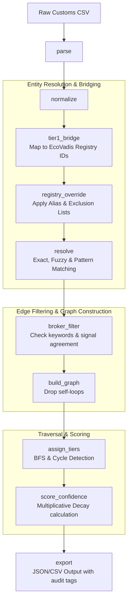
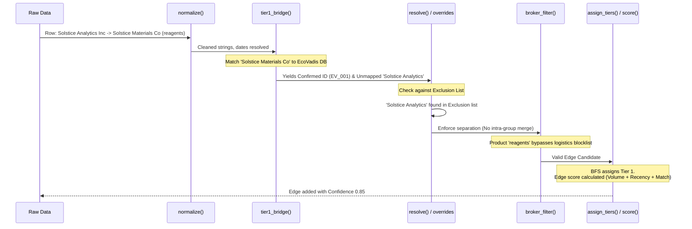

# Part 2: Architecture & Heuristics Sketch

## 1. Data Inconsistencies & Resolution Pipeline
To process the noisy customs extract into a safe, defensible Tier-N signal, we pass the data through a sequential pipeline. Below is the mapping of real-world data issues to the specific components responsible for handling them:

| Issue / Artifact | Example from Data | Handling Strategy | Component |
| :--- | :--- | :--- | :--- |
| **Formatting Noise** | Mixed dates (`2026-02-05`, `13/06/2026`), stray whitespace, casing. | Explicitly enforce **day-first** date parsing (inferred safely from `13/06/2026`). Case/whitespace fold, strip legal suffixes to metadata. Drop exact duplicates. | `normalize()` |
| **Confirmed Aliases** | *Solstice Materials Europe GmbH* = *Bergwerk Mining Alias GmbH* | Apply manual Alias Dictionary before fuzzy logic. Force-merge into one node (Confidence 1.0). | `registry_override()` |
| **Coincidental Names** | *Solstice Analytics Inc* vs. *Solstice Materials Co* | Apply manual Exclusion List. Force-block the merge despite string similarity. | `registry_override()` |
| **Suspected Intra-Group** | *Solstice Materials Iberia SA*, *Rutile Mineral Holdings Pty* | Detect naming shape patterns (root + region/Holdings/Distribution/Group). Park as "candidate affiliate, unconfirmed" (Medium confidence). Do not blindly merge. | `resolve()` |
| **Pass-through Brokers** | *Global Cargo Solutions LLC* (packaging materials) | Check product descriptions against a keyword blocklist (freight, packaging). If name pattern + product keyword agree, raise exclusion confidence. | `broker_filter()` |
| **Self-loops** | *Rutile Mineral Holdings* $\rightarrow$ *Rutile Mineral Exports* | If source and target resolve to the same node, drop the edge and log as a data artifact. | `build_graph()` |
| **Circular References** | *Rutile Mineral Holdings Pty* $\leftrightarrow$ *Rutile Mineral Exports Pty* | Maintain a visited-set during BFS traversal. If a node is revisited, flag a cycle and stop traversal for that branch to prevent infinite loops. | `assign_tiers()` |

## 2. Key Architectural Design Points

### Merging with Confirmed Tier-1 (`tier1_bridge`)
Before inferring new relationships, the pipeline must attempt to map raw entities to existing EcoVadis confirmed registry IDs. 
* **Conflict Resolution:** If customs inference conflicts with EcoVadis platform data, **confirmed data always wins**. 
* **Provisional Minting:** Only genuinely new entities that fail to map to the registry get a provisional ID, explicitly tagged with `source: customs_inference` to prevent downstream systems from confusing inferred guesses with confirmed facts.

### Edge Confidence Score Calculation (V1 Experimental Formula)

Because we lack a ground-truth API for deep-tier relationships, the base confidence of any single edge (hop) must be calculated using an experimental composite score. For V1, this is a heuristic formula based on shipment metadata, designed to be calibrated later via human-in-the-loop feedback.

The base **Edge Confidence** (0.0 to 1.0) is calculated by weighting three signals:
1. **Recency Score ($w=0.3$):** Time-decay based on `shipment_date`. A shipment from 2 weeks ago scores closer to 1.0; a single shipment from 11 months ago scores closer to 0.3.
2. **Frequency Score ($w=0.4$):** Normalized row count. 15 bills of lading in 6 months yields a high score; 1 isolated shipment yields a low score.
3. **Volume Score ($w=0.3$):** Based on `weight_kg`. Bulk shipments of raw materials score higher than small, potential "sample" shipments.

**Base Edge Formula:**
`Edge_Confidence = (Recency * 0.3) + (Frequency * 0.4) + (Volume * 0.3)`

**Compounding Path Confidence (Tier-N Decay):**
As we traverse deeper into the supply chain, uncertainty compounds. The confidence of a Tier-N node is the product of all edge confidences along the path back to the anchor company.
* **Tier 1:** Solstice $\rightarrow$ Supplier A (Edge Confidence: 0.90) = **0.90**
* **Tier 2:** Supplier A $\rightarrow$ Supplier B (Edge Confidence: 0.80) = `0.90 * 0.80` = **0.72**
* **Tier 3:** Supplier B $\rightarrow$ Supplier C (Edge Confidence: 0.85) = `0.72 * 0.85` = **0.612**

*Note: If multiple paths exist to the same Tier-N supplier, the graph retains the path with the highest maximum compounded confidence.*
---

## 3. System Diagrams

### Component Architecture
This diagram outlines the sequential, layered flow of data from raw CSV to graph output.

### Sequence Flow: Processing Ambiguous & Confirmed Data
This sequence illustrates how the pipeline handles a complex row, applying the EcoVadis bridge, overrides, and multi-factor filtering.

