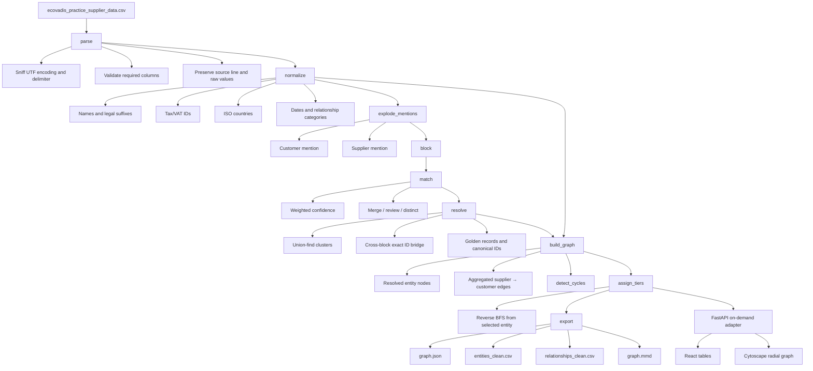
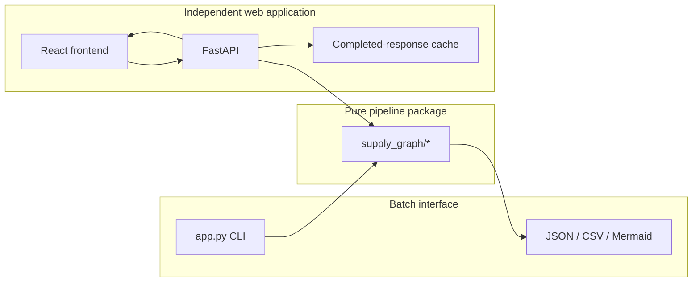
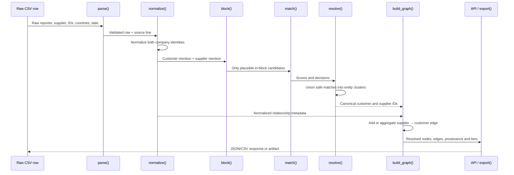

# Data Treatment, Architecture, and Trade-offs

This document explains how the project transforms a noisy supplier export into already-resolved entities and a multi-tier relationship graph. It records the decisions behind the implementation so they can be defended, audited, and changed deliberately.

## 1. Problem and source data

The source combines three self-reporting channels across roughly three fiscal years:

| Source | Rows |
|---|---:|
| `portal_v2` | 812 |
| `portal_v1` | 269 |
| `legacy_manual_import` | 258 |
| **Total** | **1,339** |

Each row says: **the reporting company declares a supplier relationship**. It is not a master-data record and it is not independently verified. Both sides of a row are entity mentions:

- `reported_by` is the customer/buyer;
- `declared_supplier` is the supplier;
- the graph edge is therefore `declared_supplier → reported_by`.

The file is UTF-8 and comma-delimited. Parsing produces 2,678 possible mentions; five lack a usable company name, leaving 2,673 mentions for resolution.

### Missing source fields

| Field | Missing rows | Treatment |
|---|---:|---|
| `reported_by` | 3 | Keep the raw row; no customer entity can be created. |
| `declared_supplier` | 2 | Keep the raw row; no supplier entity or edge can be created. |
| `reported_by_tax_id` | 169 | Treat as unknown, never as proof of a different company. |
| `declared_supplier_tax_id` | 237 | Same policy. |
| `last_updated` | 87 | Preserve as missing; do not invent a date. |
| `notes` | 729 | Preserve as optional source metadata. |

We do not silently drop structurally incomplete relationships from the clean table. A graph edge is omitted only when one endpoint cannot be resolved or when supplier and customer resolve to the same entity.

## 2. Pipeline architecture



### Runtime boundaries



`app.py` knows nothing about HTTP. FastAPI is an adapter over the same pipeline layers, not the owner of resolution logic.

## 3. Sequence of one relationship row



## 4. Data treatment, step by step

### 4.1 Parsing and traceability

`parse()` first sniffs encoding and delimiter instead of assuming them. It validates the expected schema and loads business fields as strings, preventing pandas from turning IDs into numbers or removing leading zeros.

Every row retains:

- its original `row_id`;
- `_file_line` for diagnosis;
- source file, encoding, and delimiter metadata;
- all raw business values.

The clean outputs add normalized fields; they do not overwrite the source evidence.

### 4.2 Company names

Name normalization:

1. converts blanks and null-like strings to `None`;
2. lowercases and strips accents;
3. converts punctuation to token boundaries;
4. collapses repeated whitespace;
5. separates recognized legal suffixes from the core name.

Examples:

| Raw | Core name | Suffix metadata |
|---|---|---|
| `GLOBAL ALLOYS SARL` | `global alloys` | `sarl` |
| `Pacific  Metals  Inc.` | `pacific metals` | `inc` |
| `Highland Steel Sp. z .oo.` | `highland steel` | `sp z oo` |
| `NorthGate Textiles S.A.` | `northgate textiles` | `s a` |

The suffix is not discarded: it remains metadata, but it does not dominate identity matching. `S.A.` versus `SA` should not create two companies.

### 4.3 Tax and VAT IDs

IDs are uppercased and stripped of spaces, dashes, dots, and slashes.

Recognized ISO country prefixes are removed when the remaining local part starts with a digit. The country is modeled separately, and the source uses both prefixed and unprefixed forms:

| Raw forms | Canonical ID |
|---|---|
| `ES60227680G`, `60227680G`, `es60227680g` | `60227680G` |
| `FR02653954607` | `02653954607` |
| `11-7347262` | `117347262` |

The ISO-code and numeric-local-part checks avoid blindly removing the first two letters from arbitrary local identifiers.

### 4.4 Countries

Countries become ISO alpha-2 codes through explicit dataset aliases followed by `pycountry` lookup.

| Raw values | Canonical |
|---|---|
| `España`, `Espagne`, `Spain`, `ES` | `ES` |
| `Maroc`, `Morocco`, `MA` | `MA` |
| `Türkiye`, `Turkey`, `TR` | `TR` |
| `Vietnam`, `VN` | `VN` |
| `USA`, `United States`, `US` | `US` |

An unknown country becomes `None`; the row remains available. After normalization, 310 of 2,678 mentions still have no mapped country.

### 4.5 Dates and relationship categories

The source mixes:

- ISO `YYYY-MM-DD`;
- European `DD/MM/YYYY` and `DD-MM-YYYY`;
- US `MM-DD-YYYY`, for example `03-16-2022`.

Unambiguous values are parsed by their shape. If both first numbers are ≤12, day-first is chosen because the data is primarily European. Invalid values become `None`, while the raw date remains in the raw table.

Relationship types are lowercased, accent-stripped, and converted to snake case. For example, `raw material`, `RAW_MATERIAL`, and `Raw Material` all become `raw_material`. Semantic translation is intentionally out of scope, so `materia_prima` remains distinct from `raw_material`.

## 5. Candidate generation and matching

### Blocking

Comparing all 2,673 valid mentions would require about 3.57 million unordered comparisons. Instead, mentions are grouped by:

```text
normalized country + first two letters of normalized core name
```

Examples: `FR|gl`, `ES|no`, `_|no` when country is missing.

Blocking makes matching practical and reduces unrelated comparisons. Its recall limitation is documented under risks.

### Similarity score

Candidates inside a block receive an explicit score:

```text
confidence = 0.50 × name + 0.30 × tax_id + 0.20 × country
```

- **Name:** average of RapidFuzz token-set and token-sort ratios.
- **Tax ID:** 100 for exact canonical equality, 0 for conflict, 50 when either side is missing.
- **Country:** 100 for equality, 0 for conflict, 50 when either side is missing.

Missing data is neutral, not negative. This matters because lack of an ID means “not reported,” not “different company.”

| Confidence | Decision |
|---:|---|
| ≥85 | Automatic merge |
| 65 to <85 | `flagged_for_review`; do not merge |
| <65 | Distinct |

Real sentinel outcomes:

| Pair | Evidence | Score / decision |
|---|---|---|
| `GLOBAL ALLOYS SARL` vs `Global  Alloys  SARL` | Exact core/country; one VAT missing | 85 / merge |
| `Pacific Metals` vs `Pacific Meatls` | Typo but exact ID and country | 96.43 / merge |
| `Meridian` vs `Meirdian Foundry` | Transposition but exact ID and country | 96.88 / merge |
| `Horizon Alloys` vs `Global Alloys` | Similar suffix token, conflicting ID and country | 30.6 / distinct |

## 6. Resolution and the NorthGate correction

High-confidence pairs are clustered with union-find. Exact duplicates also collapse on `core_name + tax_id + country` without requiring another fuzzy comparison.

Country-based blocking originally left four NorthGate entities because:

1. `Espagne` was not mapped to `ES`;
2. `ES60227680G` and `60227680G` were treated as different IDs;
3. missing-country mentions were placed in a different block;
4. `S.A.` and `SA` produced different suffix metadata, although their core names were equal.

The correction was deliberately narrow:

- add `Espagne → ES`;
- canonicalize the optional VAT prefix;
- bridge country blocks only on exact canonical core name and exact populated tax ID;
- refuse that bridge if populated countries conflict.

Result:

```text
entity_id:       E258
canonical_name:  NorthGate Textiles S.A.
core_name:       northgate textiles
tax_id:          60227680G
country:         ES
mention_count:   49
```

Traceable raw variants include:

- `NORTHGATE TEXTILES S.A.`
- `NorthGate Textiles S.A.`
- `NorthGate Textiles SA`
- `NotrhGate Textiles S.A.`
- `northgate textiles s.a.`

The regression suite also proves that exact names with conflicting populated tax IDs and countries remain separate.

### Golden record selection

For each cluster:

1. prefer mentions containing a tax ID;
2. choose the most frequent raw name among those mentions;
3. take the first available canonical tax ID, country, and suffix;
4. retain every raw name in `raw_variants`;
5. record `mention_count`.

Canonical IDs (`E001`, `E002`, …) are deterministic for a fixed input and algorithm, but they are batch-local technical identifiers—not permanent global IDs.

## 7. Graph construction and tiers

### Nodes

Each node is a resolved entity, not a raw company string. It carries its canonical identity, source variants, and mention count.

### Edges

Edges point `supplier → customer`, matching the flow of supplied goods. Duplicate declarations for the same resolved pair become one edge with aggregated:

- source row IDs;
- source systems;
- relationship types;
- dates and notes.

Edge confidence is currently `1.0`, meaning “this relationship was observed in at least one declaration.” It does **not** mean the relationship was independently verified. Entity uncertainty remains represented by review candidates and source provenance.

### Tier assignment

For a selected company:

- tier 0 is the selected entity;
- tier 1 directly supplies tier 0;
- tier 2 supplies tier 1;
- and so on.

Because stored edges point toward customers, tiering runs BFS on the reverse graph. A visited set prevents infinite traversal through cycles. Cycles are also detected and exported explicitly.

For NorthGate:

| Tier | Entities |
|---:|---:|
| 0 | 1 |
| 1 | 16 |
| 2 | 71 |
| 3 | 128 |
| 4 | 123 |
| **Total** | **339** |

The graph contains 349 aggregated upstream relationships.

## 8. Web-serving design

FastAPI and the React frontend are isolated from the batch CLI.

The API intentionally avoids resolving the full graph at startup:

1. startup stores only the CSV path;
2. a raw-table request reads only the CSV;
3. an uncached entity, clean-data, or graph request creates the necessary pipeline state;
4. the response is serialized;
5. heavy pandas and NetworkX working state is released;
6. only the completed JSON response is cached.

Cache keys include the source CSV modification time, so changing the file bypasses prior responses. A lock prevents two identical first requests from constructing state concurrently.

The frontend uses server-side pagination for tables and Cytoscape for interactive graph rendering. The radial layout groups nodes by tier, while pan, zoom, center-root, and fit-all controls handle large networks.

## 9. Trade-off memo

### Decisions made

#### Prefer false negatives over false positives

Merging two real companies corrupts every downstream relationship and tier. Missing a merge leaves duplicate nodes but preserves source truth. Therefore:

- contradictory IDs or countries receive no score for that signal;
- medium-confidence candidates are review-only;
- cross-country-block merging requires both exact core name and exact tax ID;
- an identity-less same-name mention is not globally merged when multiple contradictory identities exist.

#### Use deterministic heuristics instead of a trained model

The score is understandable in an interview, auditable in production, and works without labeled training data. The cost is less flexibility on multilingual aliases and unusual typos.

#### Keep legal suffixes as metadata

Suffix formatting is noisy and weak as an identity signal. Removing it from the matching key fixes `S.A.`/`SA` and similar variants. However, suffix changes can sometimes indicate genuinely different legal entities; tax and country conflict safeguards mitigate this risk.

#### Remove recognized VAT prefixes

This reconciles IDs exported with and without country prefixes. It assumes the first two letters are formatting when they form a real ISO code and are followed by a numeric local part. Raw IDs remain available for audit.

#### Use simple blocking

Country plus a two-letter prefix avoids all-pairs matching and is easy to explain. It may miss a company when the country is absent on one mention and present on another, or when a typo changes the first two letters. The exact name+tax bridge recovers only the safest cross-block cases.

#### Resolve per uncached web request

This gives a light server startup and avoids permanently retaining the full graph, as required for this application. The cost is several seconds on a new lookup and repeated work for different requests. Response caching improves repeated queries but is process-local.

### Known risks and limitations

1. **Union-find transitivity:** if A safely matches B and B safely matches C, all three merge even when A–C was not directly scored. Production systems should validate cluster-level conflicts after each union.
2. **Blocking recall:** prefix or country errors can prevent a valid fuzzy pair from ever being scored.
3. **Country aliases:** unmapped local-language values become missing. Alias coverage should be monitored from data-quality metrics.
4. **Ambiguous dates:** values such as `03-04-2023` are interpreted day-first by policy, not certainty.
5. **Semantic relationship aliases:** `materia_prima` and `raw_material` are formatting-normalized but not translated into one taxonomy.
6. **Review volume:** 3,097 is a count of candidate pairs, not 3,097 unique entity cases. A production review queue should deduplicate and rank cluster-level cases.
7. **Declared relationship confidence:** an observed edge is not externally verified. Confidence should eventually combine source reliability, recency, agreement across systems, and entity-resolution confidence.
8. **Batch-local IDs:** adding data or changing rules can renumber `E###` IDs. Persistent production IDs require an entity registry.
9. **In-memory processing:** pandas and NetworkX are appropriate for this dataset and interview scope, not unbounded scale.

### Production evolution

For larger or continuously arriving datasets:

1. land immutable raw files in object storage with schema and quality checks;
2. normalize incrementally into columnar storage;
3. maintain blocking indexes by country, name phonetics/n-grams, and normalized IDs;
4. persist canonical entities and aliases in an entity registry;
5. generate stable candidate-pair IDs and a human review queue;
6. version matching rules and preserve merge lineage;
7. store resolved edges in a graph database or analytical edge table;
8. materialize common root subgraphs asynchronously;
9. cache by dataset version, rule version, and root entity;
10. monitor merge rates, conflict rates, unresolved aliases, review precision, and graph changes.

Batch processing remains the simplest default for periodic full exports. Streaming is useful only when source updates and latency requirements justify the operational complexity; entity merges still need a durable, versioned state machine and human review path.

## 10. Code ownership map

| Responsibility | Module |
|---|---|
| CSV sniffing, validation, profiling | `supply_graph/parse.py` |
| Field normalization and mention creation | `supply_graph/normalize.py` |
| Candidate blocking | `supply_graph/block.py` |
| Similarity and confidence decisions | `supply_graph/match.py` |
| Union-find clusters and golden records | `supply_graph/resolve.py` |
| Graph, cycles, and BFS tiers | `supply_graph/graph.py` |
| JSON/CSV/Mermaid serialization | `supply_graph/export.py` |
| Pipeline orchestration | `supply_graph/pipeline.py` |
| CLI boundary | `app.py` |
| HTTP and caching boundary | `backend/main.py`, `backend/service.py` |
| Tables and graph UI | `frontend/src/` |

## 11. Verification strategy

Sentinels cover:

- casing and missing-ID merge;
- typo with exact tax ID;
- transposed name with exact tax ID;
- similar-name false-positive protection;
- `Espagne` and optional VAT-prefix normalization;
- NorthGate consolidation;
- conflicting IDs/countries remaining distinct;
- API pagination, graph tiers, and unknown entity handling.

Run:

```bash
source .venv/bin/activate
pytest -q

cd frontend
npm run lint
npm run build
```
