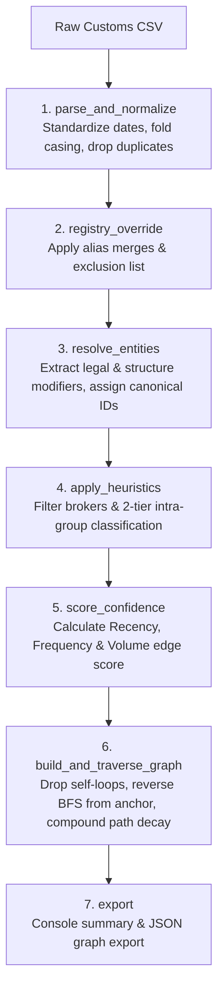
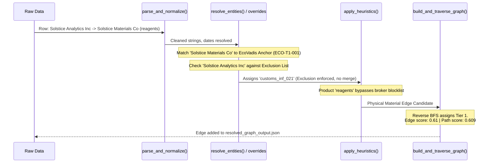

# Part 2: Architecture & Heuristics Sketch

## 1. Data Inconsistencies & Resolution Pipeline
To process the noisy customs extract into a safe, defensible Tier-N signal, we pass the data through a sequential pipeline. Below is the mapping of real-world data issues to the specific components responsible for handling them:

| Issue / Artifact | Example from Data | Handling Strategy | Component |
| :--- | :--- | :--- | :--- |
| **Formatting Noise** | Mixed dates (`2026-02-05`, `13/06/2026`), stray whitespace, casing. | Explicitly enforce **day-first** date parsing (inferred safely from `13/06/2026`). Case/whitespace fold, strip legal suffixes to metadata. Drop exact duplicates. | `parse_and_normalize()` |
| **Confirmed Aliases** | *Solstice Materials Europe GmbH* = *Bergwerk Mining Alias GmbH* | Apply manual Alias Dictionary before fuzzy logic. Force-merge into one node (Confidence 1.0). | `registry_override()` |
| **Coincidental Names** | *Solstice Analytics Inc* vs. *Solstice Materials Co* | Apply manual Exclusion List. Force-block the merge despite string similarity. | `registry_override()` |
| **Suspected Intra-Group** | *Solstice Materials Iberia SA*, *Rutile Mineral Holdings Pty* | Detect naming shape patterns (root + region/Holdings/Distribution/Group). Park as "candidate affiliate, unconfirmed" (Medium confidence 0.5). Do not merge into confirmed bucket. | `apply_heuristics()` |
| **Pass-through Brokers** | *Global Cargo Solutions LLC* (packaging materials) | Check product descriptions against a keyword blocklist (freight, packaging). Park as pass-through forwarders. | `apply_heuristics()` |
| **Self-loops** | *Rutile Mineral Holdings* $\rightarrow$ *Rutile Mineral Exports* | If source and target resolve to the same node post-resolution, drop the edge and log as a data artifact. | `build_and_traverse_graph()` |
| **Circular References** | *Rutile Mineral Holdings Pty* $\leftrightarrow$ *Rutile Mineral Exports Pty* | Maintain a visited-path during BFS traversal. If a node is revisited, flag a cycle and stop traversal for that branch to prevent infinite loops. | `build_and_traverse_graph()` |

---

## 2. Key Architectural Design Points

### Merging with Confirmed Tier-1 (`tier1_bridge`)
Before inferring new relationships, the pipeline maps raw entities to existing EcoVadis confirmed registry IDs. 
* **Conflict Resolution:** If customs inference conflicts with EcoVadis platform data, **confirmed data always wins**. 
* **Provisional Minting:** Only genuinely new entities that fail to map to the registry get a provisional ID, explicitly tagged with `source: customs_inference` (e.g. `customs_inf_001`) to prevent downstream systems from confusing inferred guesses with confirmed facts.

### Edge Confidence Score Calculation (V1 Experimental Formula)

Because we lack a ground-truth API for deep-tier relationships, the base confidence of any single edge (hop) is calculated using an experimental composite score. For V1, this is a heuristic formula based on shipment metadata:

$$\text{Edge Confidence} = (0.3 \times \text{Recency}) + (0.4 \times \text{Frequency}) + (0.3 \times \text{Volume})$$

1. **Recency Score ($w=0.3$):** Exponential time-decay based on `shipment_date` ($e^{-0.005 \times \text{days}}$).
2. **Frequency Score ($w=0.4$):** Scaled shipment count.
3. **Volume Score ($w=0.3$):** Normalized log weight ($\log(1 + \text{weight\_kg})$). Missing weights fall back to a neutral score ($0.5$).

### Compounding Path Confidence (Tier-N Decay)
As we traverse deeper into the supply chain, uncertainty compounds exponentially. The confidence of a Tier-N node is the product of all edge confidences along the path back to anchor company `ECO-T1-001`:

$$\text{Path Confidence}(T_n) = \prod_{i=1}^n \text{Edge Confidence}_i$$

* **Tier 1:** Solstice $\leftarrow$ Supplier A (Edge Confidence: 0.89) = **0.892**
* **Tier 2:** Supplier A $\leftarrow$ Supplier B (Edge Confidence: 0.76) = `0.892 * 0.76` = **0.676**
* **Tier 3:** Supplier B $\leftarrow$ Supplier C (Edge Confidence: 0.73) = `0.676 * 0.73` = **0.491**

---

## 3. System Diagrams

### Component Architecture
This diagram outlines the sequential flow of data from raw CSV to graph export.

### Sequence Flow: Record Resolution & Filtering

